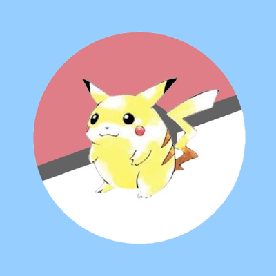

<div align="center">



# LumioseCraft

**Cobblemon modpack with Create for fun and automation**

[](https://www.curseforge.com/minecraft/modpacks/lumiosecraft)

</div>

---

## About

This modpack features Cobblemon, allowing players to explore the world, catch and train Pokémon-like creatures, and engage in battles. Create is included to provide an interesting automation system for streamlining processes such as Poké Ball crafting, item transportation, and mechanical contraptions.

The modpack encourages creativity, teamwork, and adventure, making it a perfect balance between exploration, strategy, and engineering.

Whether you're a Pokémon trainer looking to become the very best or an engineer who loves designing complex machinery, this modpack offers something for everyone!

Other than Cobblemon and Create the modpack contains mods like Sodium to improve performance on the client-side as well as server-side.

The [MysticMons](https://modrinth.com/datapack/mysticmons) and [AllTheMons](https://modrinth.com/datapack/allthemons) datapacks have been used to add missing cobblemon models to the modpack.

## Contributing

### KubeJS Setup

To get typescript support in kubejs scripts, you will need to generate typings using [ProbeJS](https://www.curseforge.com/minecraft/mc-mods/probejs). To do this, follow the steps below.

1. Download the latest version of this modpack, add ProbeJS to it.
2. Start up Minecraft with this modpack.
3. Create a new world and enter it. This should generate KubeJS typings with ProbeJS.
4. Go into the instance folder of your modpack.
5. Copy the .probe folder and paste it in the lumiosecraft folder.

The resulting folder structure should look like the following:

```
lumiosecraft
├── .probe
│   ├── classes.txt
│   ├── client
│   │   └── probe-types
│   │       ├── global
│   │       └── packages
│   ├── decompiled
│   ├── images
│   ├── server
│   │   └── probe-types
│   │       ├── global
│   │       └── packages
│   └── startup
│       └── probe-types
│           ├── global
│           └── packages
├── .vscode
├── src
└── ...
```
